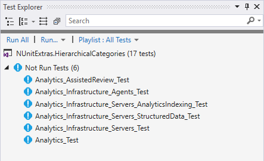
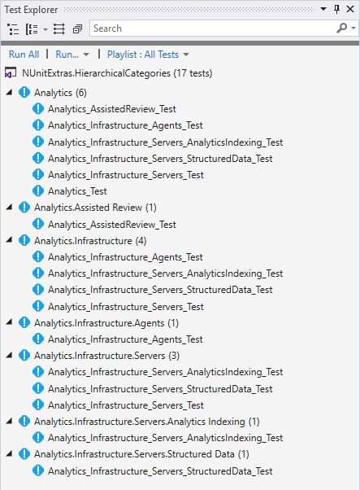

# NUnitExtras.HierarchicalCategories

[](https://www.nuget.org/packages/NUnitExtras.HierarchicalCategories/)
[](https://github.com/YevgeniyShunevych/nunitextras-hierarchicalcategories/releases)

Provides a functionality for hierarchical categorization of NUnit tests with the following way:

```cs
[Test]
[Module.ParentModule.SubModule.SomeFeature]
public void SomeTest()
{
}
```

And the test will get all 3 categories for each module level:

- `"Parent Module"`
- `"Parent Module.Sub Module"`
- `"Parent Module.Sub Module.Some Feature"`

It will give you ability to filter NUnit tests using any complex category filters in build pipelines or wherever.

Above sample is equal to the following vanilla NUnit sample:

```cs
[Test]
[Category("Parent Module")]
[Category("Parent Module.Sub Module")]
[Category("Parent Module.Sub Module.Some Feature")]
public void SomeTest()
{
}
```

## Usage

### Modules definition class

Define class which contains nested hierarchy of class attributes for modules:

```cs
using NUnit.Extras;

namespace NUnitExtras.HierarchicalCategories.Tests;

public static class Feature
{
    public class Analytics : HierarchicalCategoryAttribute
    {
        public class AssistedReview : HierarchicalCategoryAttribute
        {
        }

        public class Infrastructure : HierarchicalCategoryAttribute
        {
            public class Agents : HierarchicalCategoryAttribute
            {
            }

            public class Servers : HierarchicalCategoryAttribute
            {
                public class AnalyticsIndexing : HierarchicalCategoryAttribute
                {
                }

                public class StructuredData : HierarchicalCategoryAttribute
                {
                }
            }
        }
    }
}
```

All module attributes should inherit `HierarchicalCategoryAttribute`.
Root class can be static without attributes.
Typically name it with a category name, like `Feature`, `Module`, `Component`, etc.

### Use in tests

Mark tests with corresponding attributes:

```cs
[Test]
[Feature.Analytics.Infrastructure.Agents]
public void Analytics_Infrastructure_Agents_Test()
{
    TestCategories.Should().BeEquivalentTo(
        "Analytics",
        "Analytics.Infrastructure",
        "Analytics.Infrastructure.Agents");
}

[Test]
[Feature.Analytics.Infrastructure.Servers]
public void Analytics_Infrastructure_Servers_Test()
{
    TestCategories.Should().BeEquivalentTo(
        "Analytics",
        "Analytics.Infrastructure",
        "Analytics.Infrastructure.Servers");
}

[Test]
[Feature.Analytics.Infrastructure.Servers.AnalyticsIndexing]
public void Analytics_Infrastructure_Servers_AnalyticsIndexing_Test()
{
    TestCategories.Should().BeEquivalentTo(
        "Analytics",
        "Analytics.Infrastructure",
        "Analytics.Infrastructure.Servers",
        "Analytics.Infrastructure.Servers.Analytics Indexing");
}
```

#### Tests grouped by outcome



#### Tests grouped by traits



### Apply to test class/fixture

You can also apply attributes to fixtures.
This will apply the category traits to all child tests.

```cs
[TestFixture]
[Module.UI.Authentication]
public class SomeTests
{
    // Tests...
}
```

### Multiple categories

Also possible to apply multiple hierarchical categories to tests, fixtures and assemblies.

```cs
[Test]
[Module.UI.Authentication.Admin]
[Module.UI.Products.Editing]
public void SomeTest()
{
}
```

### Special naming

To set specific module name that contains special characters that are not allowed in class naming
or for name override use `HierarchicalCategoryNameAttribute`:

```cs
[HierarchicalCategoryName("Installation & Deployment")]
public class InstallationAndDeployment : HierarchicalCategoryAttribute
{
}
```

### Settings

Use `HierarchicalCategorySettingsAttribute` to change the default settings or attribute applying behavior.
`HierarchicalCategorySettingsAttribute` provides ability to apply hierarchical categories not only as NUnit categories but also as custom NUnit properties.

#### `HierarchicalCategorySettingsAttribute` properties

```cs
public string CategorySeparator { get; set; }
```

Gets or sets the category separator.
The default value is `"."`.
___

```cs
public string WordSeparator { get; set; }
```

Gets or sets the category word separator.
The default value is `" "`.
___

```cs
public string[] ApplyEachLevelToTestProperties { get; set; }
```

Gets or sets the names of the test properties to apply each hierarchical level to,
such as "lvl1", "lvl1.1" and "lvl1.1.1".
By default contains `PropertyNames.Category` (`"Category"`).
Set the property to `[]` to disuse.
___

```cs
public string[] ApplyTopLevelToTestProperties { get; set; }
```

Gets or sets the names of the test properties to apply only top hierarchical level to,
such as "lvl1.1.1", excluding "lvl1" and "lvl1.1".
By default is empty.

### Apply top level categories only

Add `HierarchicalCategorySettingsAttribute` as below, if you need to apply only top levels,
such as "lvl1.1.1", excluding intermediate "lvl1", "lvl1.1".

```cs
[HierarchicalCategorySettings(
    ApplyTopLevelToTestProperties = ["Feature"], // For default category: [PropertyNames.Category]
    ApplyEachLevelToTestProperties = [])]
public static class Feature
{
    public class Analytics : HierarchicalCategoryAttribute
    {
        //...
    }

    //...
}
```

## Contact

If you faced an issue or have a feature request please report it to [Issues](../../issues) or just mail to yevgeniy.shunevych@gmail.com.

## License

`NUnitExtras.HierarchicalCategories` is an open source software, licensed under the Apache License 2.0.
See [LICENSE](LICENSE) for details.